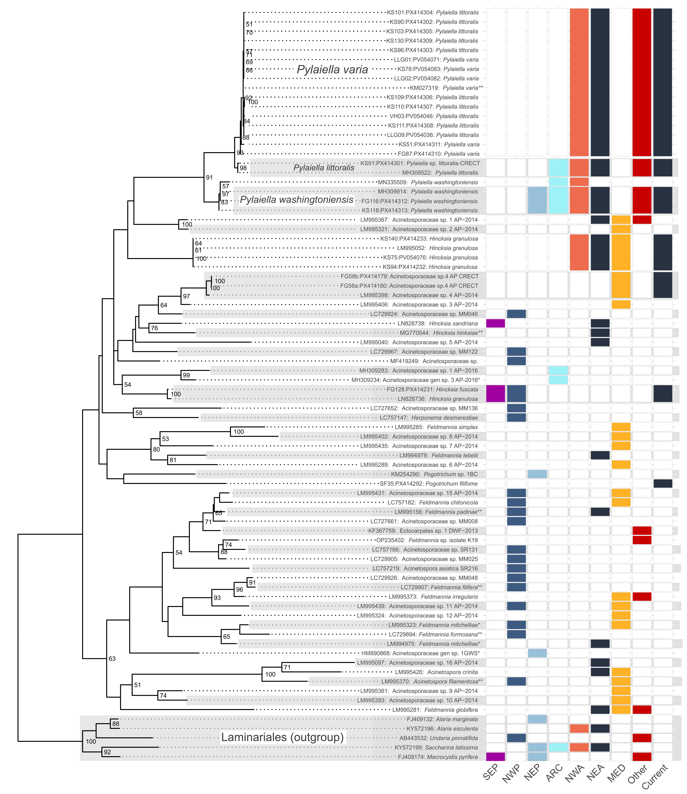
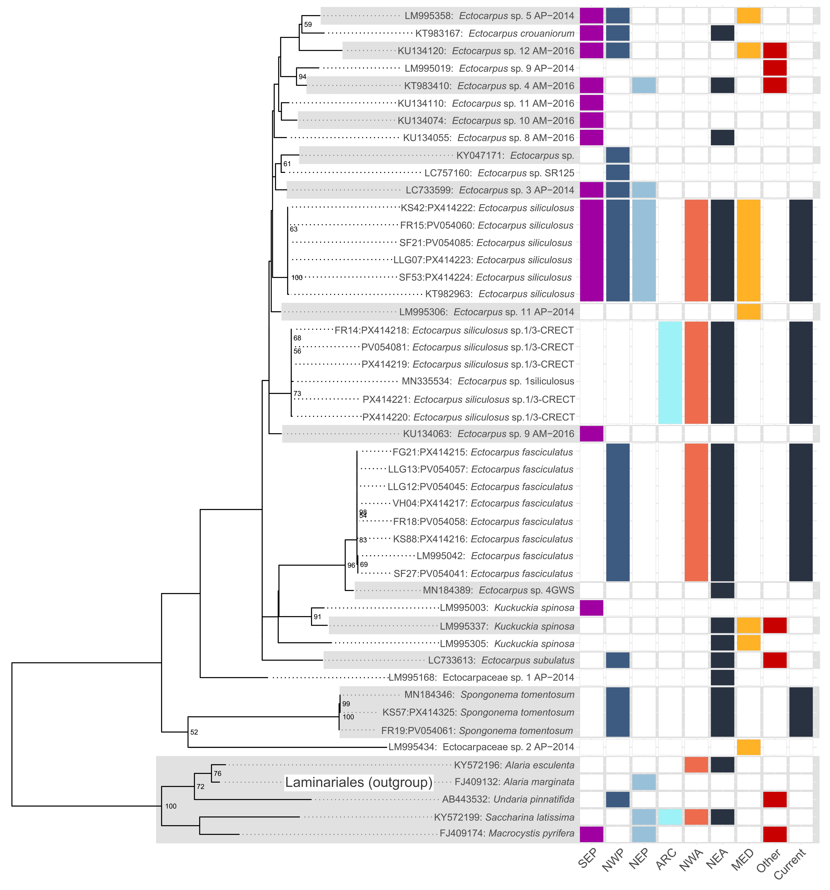
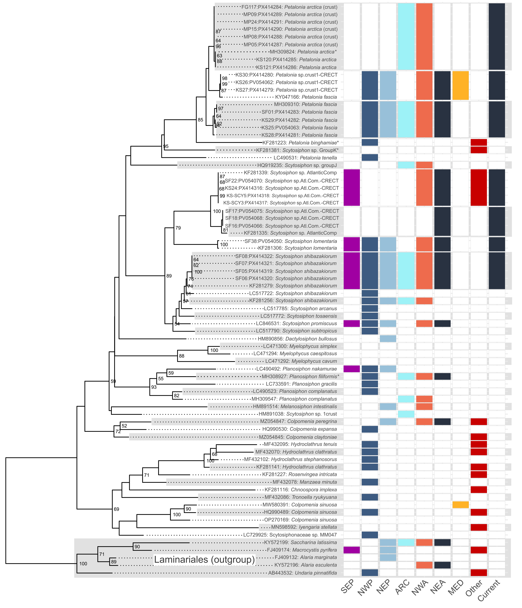
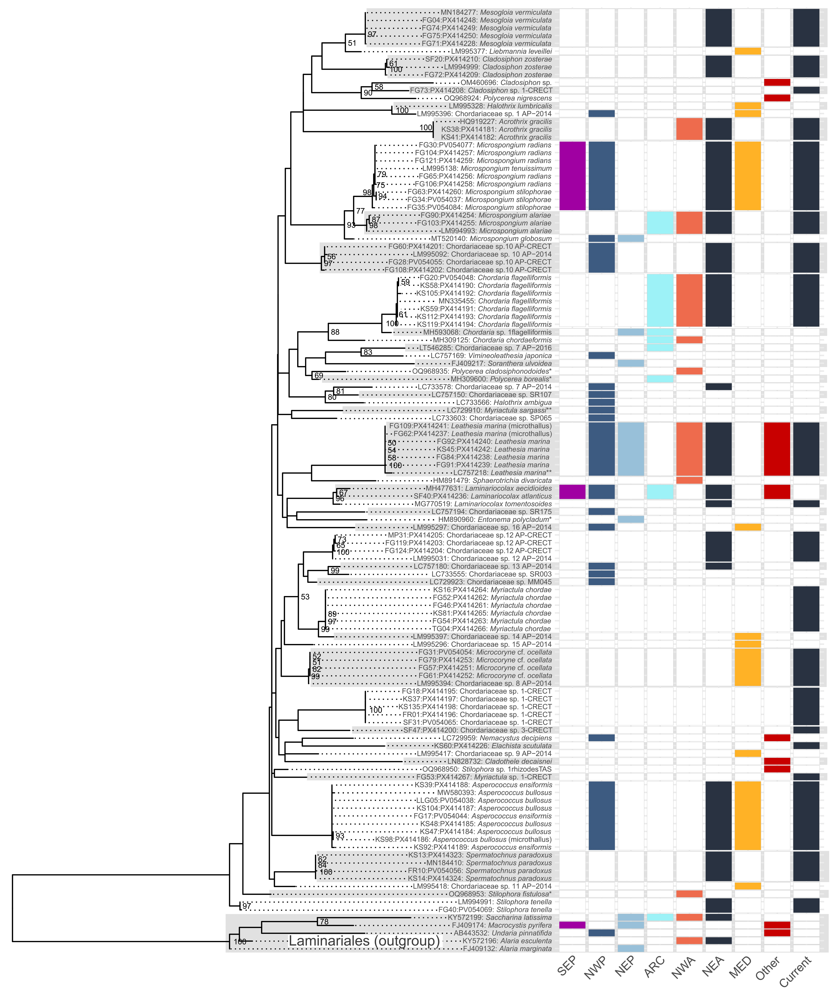
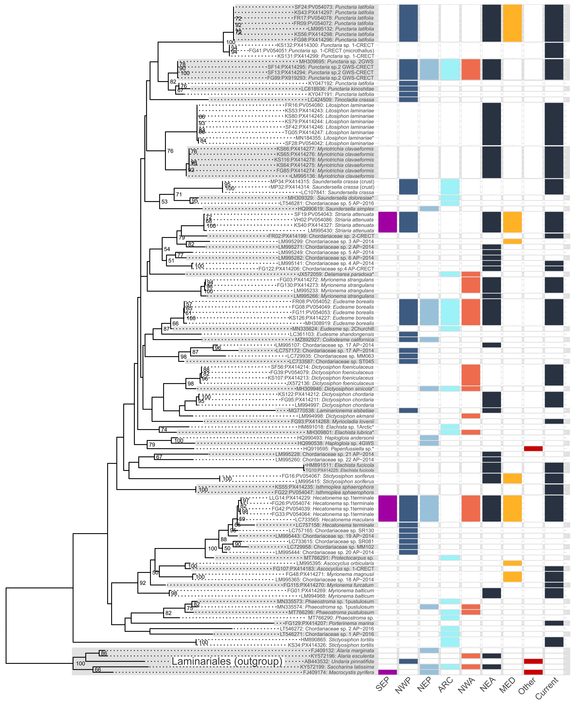

# Norwegian_Ectocarpales_Explororer
The Fehu rune symbol ᚠ means wealth, prosperity, and abundance, a reflection of the dominance of Ectocarpales in terms of brown algal species diversity

The app is currently live and hosted by shiny.io: https://tbringloe.shinyapps.io/Norway_Ectocarpales_Survey/

The repository hosts a shiny app for exploring Ectocarpales (Phaeophyceae) sequences generated through molecular-morphological surveys conducted in Norway from 2022-2024, funded through the Norwegian Taxonomic Initiative awarded to Kjersti et al.

The app has several features. User inputs include exploring Norwegian survey specific data and/or GenBank data. These data have been curated based on recent literature and taxonomic findings. The User determines which taxa to include by narrowing down the taxonomic fields. A distance model is specified and the tree is computed.

The neighbour joining tree uses coxI data and selected distance model, calculated using the dna.dist function of ape R package. An asterisk indicates a specimen sampled through the Norwegian Taxonomic Initiative (2022-2024). If plot looks messy (adjusting window, data filters), simply hit compute to reset with selected inputs. Note the coxI data are reliable for clustering species, but do not accurately reflect intergeneric relationships. The tree is not bootstrapped or rooted. Some genbank accessions species IDs were updated, see species metadata below for original IDs. Please down sample the tree with user inputs if too many sequences are crowding the output.

A table with specimen information, including previous IDs and geographic locations is also provided. The bioregions are displayed on an interactive map and the user can download the tree as an image or PDF.

This shiny app accompanies the publication of Goerke et al. (2026): An update of the brown algal order Ectocarpales (Phaeophyceae) for Norway, with new records and the reinstatement of Porterinema marina Jaasund. The materials are only uptodate as of the time of publication submission (early 2026).

To reiterate, as noted above, tree performance is not optimized. Users can log concerns through the repo. The shiny app is simply intended to showcase the state of knowledge at the time of publication. We look forward to further advancements in the near future.

We encourage users to adapt this app for other taxonomic studies and to improve user accessibility for molecularly assisted taxonomic surveys. Please see LICENCE.

Below are static ML trees:

Phylogenies are maximum likelihood as constructed using RAxML

Data were imported into R (R Core Team 2025) and using ape (Paradis and Schliep 2019) and phangorn (Schliep 2011; Schliep et al. 2017) packages, sequences were clustered and classified at a 2% threshold. Associated metadata were used to infer geographic distribution of all clusters. A single cluster representative was randomly chosen using the seqinr package (Charif and Lobry 2007) in R, and new alignments were made for each family using MAFFT. A maximum-likelihood tree was constructed using RAxML (Stamatakis 2014) using a GTR GAMMA I substitution model, with partitioning by codon position and 100 bootstrap replicates. The finalized tree was imported into R and plotted using ggtree (Guangchuang 2020). Geographic locations of the coxI clusters was also plotted as a heatmap using ggplot (Wickham 2016) in R. These figures  are presented here as supplemental.

Nodes without a boostrap value have less than 50% support.
One asterisk means species identification was updated for the exact record.
Two asterisks indicate species identification was updated based on concensus from other GenBank records.

SEP=Southeast Pacific (e.g. Chile)
NWP=Northwest Pacific (i.e., China through to Russia)
NEP=Northeast Pacific (i.e., California through Gulf of Alaska)
ARC=Arctic (i.e., Bering Sea through Arctic to Labrador [Canada], Iceland, and Northern Norway)
NWA=Northwest Atlantic (i.e., Newfoundland through to Rhode Island)
NEA=Northeast Atlantic (i.e., Norway through to Spain)
MED=Mediterranean
Other=other global locations (e.g., Australia)
Current=new sequences presented through current survey

Species identifications are working hypotheses and subject to debate and future revisions

